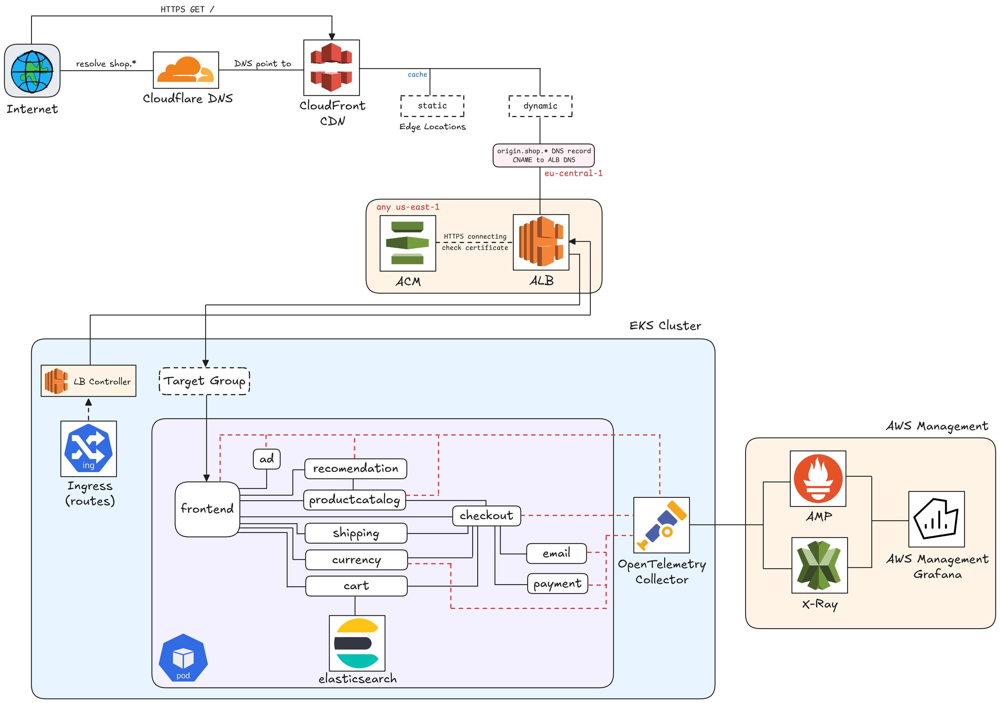
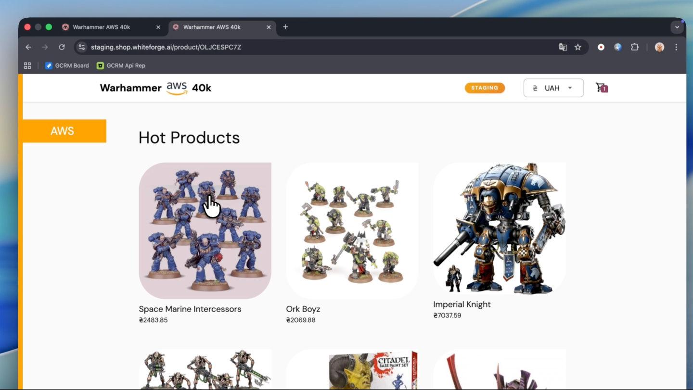

# Google Online Boutique on AWS

Microservices e-commerce demo app deployed on AWS EKS with full CI/CD and observability.

## Architecture

## Tech Stack

| Layer             | Technologies                                                 |
|-------------------|--------------------------------------------------------------|
| **Cloud**         | AWS (EKS, ECR, CloudFront, ElastiCache, ALB, KMS, ACM)       |
| **IaC**           | Terraform                                                    |
| **CI/CD**         | GitHub Actions (OIDC auth, staging/prod environments)        |
| **Orchestration** | Kubernetes (EKS 1.32), Helm, Docker                          |
| **Services**      | Go, Node.js, gRPC, Protocol Buffers                          |
| **Monitoring**    | Amazon Managed Prometheus, Grafana, AWS X-Ray, OpenTelemetry |
| **DNS/CDN**       | Cloudflare, CloudFront                                       |
| **Cache**         | ElastiCache Serverless (Valkey)                              |